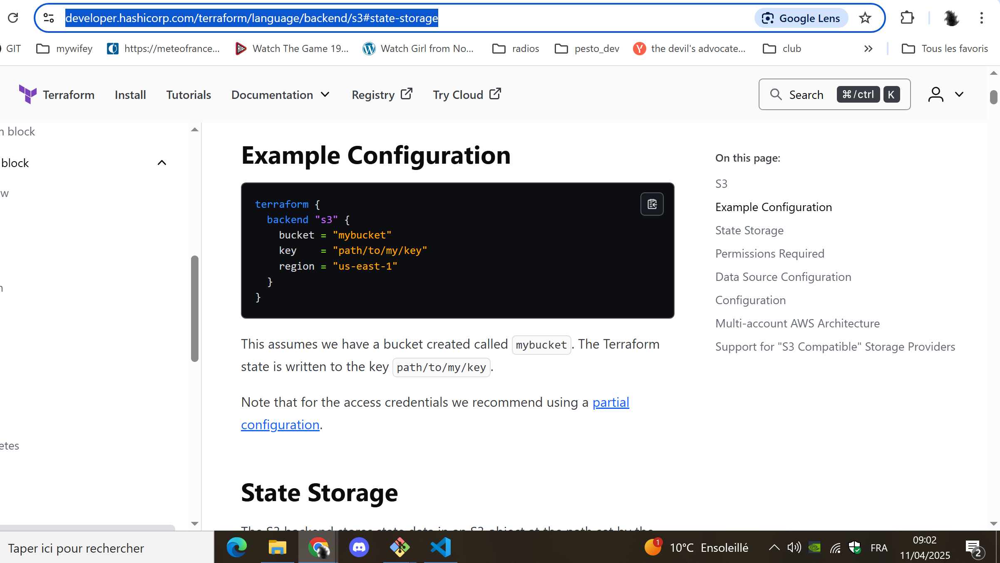
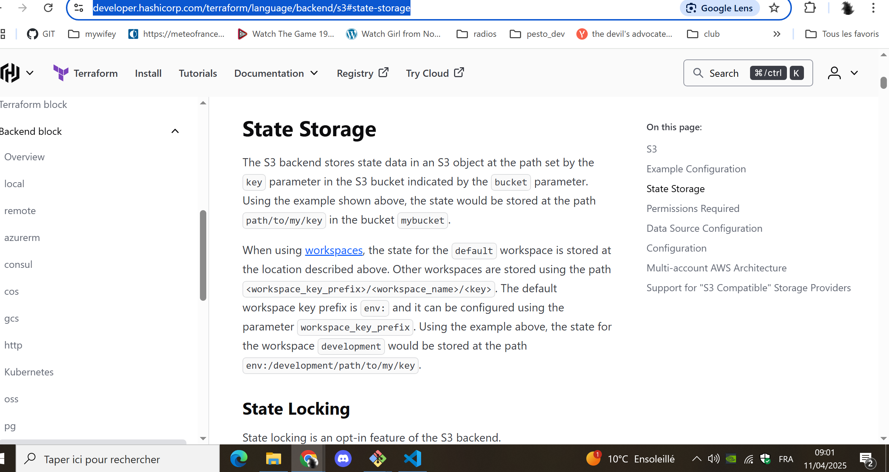

In this Topic:
* I take a look at what terraform state locking is
* I implement several setups which realize state locking, and I proves whether or not the realized state locking setup makes it posible to collaborate in a team of several people managing an infrastructure using terraform.

## Using a remote backend with state locking feature, together with runatlantis.io

Altantis is very interesting, because it proposes a state locking mechanism at higher level than the state locking features implemented at remote backend level.

Indeed, look at the Atlantis docs:

Note that versioing of the state in the remote bakend (like S3 bucket verisoning feature) is a good practice, which would allow to recover a previous state version in case of any problem.

Goals:
* setup a runatlantis service together with a Gitea, and implement a full terraform workflow which uses only the atlantis high level pull request locking mechanism. With a remote backend S3 which does not use lockfile (the s3 terraform backend uses locking if you use the `use_lockfile = true`  boolean configuration param).
* same as previous bullet point, except you use the s3 `use_lockfile = true`  boolean configuration param
* I try and put in place a collaboration workflow, without atlantis, and only with the s3 remote backend with  the s3 `use_lockfile = true`  boolean configuration param: will that locking be enough ? I want here also to test if, with the s3 bucket versioning (minio), I can recover a previous state version from the s3 bucket. So here i will use a pipeline service, the ismplest possible, either circle ci with private runners, or maybe [onedev](https://docs.onedev.io/tutorials/cicd/understanding-pipeline), we will see.
* The last case is the one I am most interested in:
  * I will implement my own [terraform backend of http type](https://developer.hashicorp.com/terraform/language/backend/http) :
    * inspired by <https://matthewzhaocc.com/building-a-custom-http-terraform-backend-160e5e2f8181> and his <https://github.com/matthewzhaocc/express-tf-state/tree/main>
    * I will implement it as a REST API using nestjs, prisma (and or redis), postgresql, and the rest api will store the state into a minio s3 bucket. I will see if that bakend could support going back to a privous s3 bucket version
    * I will implement it and see if it is a good idea to implement there a semaphore pattern (maybe its not a good idea)
    * this backend will have to support at least one  authentication method similar to those used by big players on the market
    * Here i am also extremently inserested to see how i can implement such that it will support workspaces, managing different enviroenments
  * and I will use atlantis woith my custom remote backend  

in my custom backend if it stores to s3 minio the state, I want that for workspaces it uses the sme behavior than the s3 backend (with `env:/<name of the env>/path/to/file` and fo default `workspace` the `/path/to/file` path in bucket):

References:
* <https://www.runatlantis.io/docs/locking.html#relationship-to-terraform-state-locking>
* implement your own terraform http backend:
  * <https://matthewzhaocc.com/building-a-custom-http-terraform-backend-160e5e2f8181>
  * <https://developer.hashicorp.com/terraform/language/backend/http>
  * <https://github.com/matthewzhaocc/express-tf-state/tree/main>

## Knowledge

In terraform, backends are builtin, they are not plugins that you can implement, like providers:

<https://developer.hashicorp.com/terraform/language/backend#backend-types>

